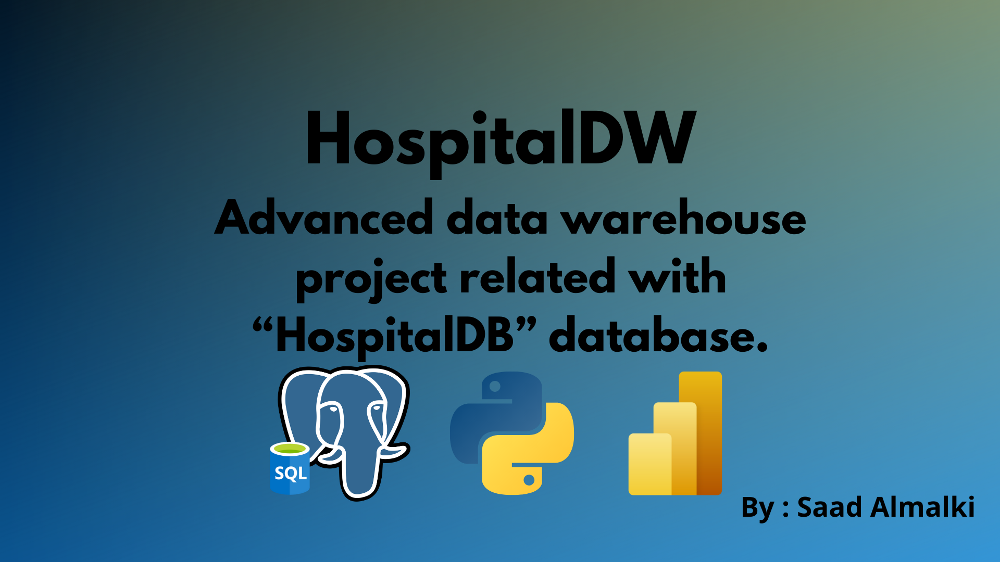

# HospitalDW
Advanced data warehouse project for [HospitalDB](https://github.com/Saad711T/HospitalDB) Database.



## Project Requirements
- [PostgreSQL](https://postgresql.org) : A RDBMS system to make and management a relational databases.
- [Python](https://python.org) : Famous high-level programming language . I used it in project to ETL processing.
- [Power BI](https://www.microsoft.com/en-us/power-platform/products/power-bi) : Strong bi/data visualization/business intelligence tool created by microsoft.

### Schemas
##### Tests
[schema](dw_schemas/tests.png)
##### Admissions
[schema](dw_schemas/admissions_schema.png)
##### Appointments
[schema](dw_schemas/appointments_schema.png)
##### Prescriptions
[schema](dw_schemas/prescriptions_schema.png)
### Project Structure
``` bash
hospital-data-warehouse/
│
├── README.md
├── requirements.txt              # The requirement libraries for Python ETL process
├── .gitignore
│
├── sql/                          # SQL files
│   ├── source_schema.sql         # Copied from HospitalDB
│   ├── create_dw_admissions.sql
│   ├── create_dw_appointments.sql
│   ├── create_dw_tests.sql
│   ├── create_dw_prescriptions.sql
│   ├── create_dw_shared_dims.sql
│
├── etl/                          # ETL files
│   ├── etl_admissions.py
│   ├── etl_appointments.py
│   ├── etl_tests.py
│   ├── etl_prescriptions.py
│   ├── common_utils.py          
│
├── dw_schemas/                  
│   ├── admissions_schema.png
│   ├── appointments_schema.png
│   ├── tests_schema.png
│   └── prescriptions_schema.png
│
├── dashboards/       # Coming soon     
│
└── docs/                        
    ├── README.md
    └── HospitalDW.pdf # Documentation for the project
```

#### Credit by :
`0xSaad / Saad Almalki`